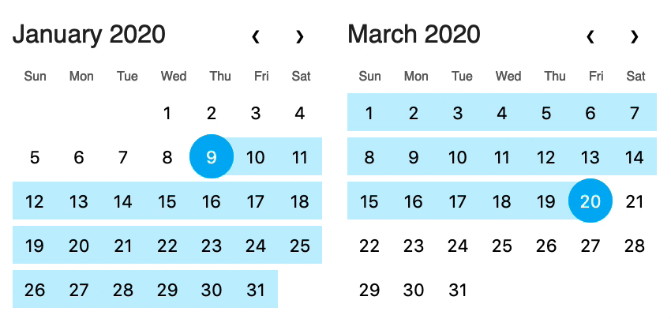

# date-range-input

A user interface for inputting date ranges.

**[Demo](http://time-tracking.pages.internal.equipmentshare.com/date-range-input/)**



## Install

```sh
npm i @equipmentshare/date-range-input
```

## How to use

The date range input takes these properties.

`start` and `end` are required.  They must be an object with these numeric properties: `year`, `month`, and `day`.

`visibleStartMonth` and `visibleEndMonth` are optional, for if you want to manually specify which month should be displayed in each calendar.  They are an object with the numeric properties `year` and `month`.

### As vanilla JS

```js
import DateRangeInput from '@equipmentshare/date-range-input'

const dateRangeInput = new DateRangeInput({
	target: document.querySelector('div.date-range-input'),
	props: {
		start: {
			year: 2020,
			month: 1,
			day: 5,
		},
		end: {
			year: 2020,
			month: 1,
			day: 18,
		},
		visibleEndMonth: {
			year: 2020,
			month: 2
		}
	}
})

dateRangeInput.$on('change', event => console.log(event.detail))
```

### As a custom element

```js
import '@equipmentshare/date-range-input/custom-element'
```

```html
<date-range-input

>
</date-range-input>
```

### As a Svelte component

```html
<script>
import DateRangeInput from '@equipmentshare/date-range-input'
</script>

<DateRangeInput
	start={ { year: 2020, month: 1, day: 10 } }
	end={ { year: 2020, month: 1, day: 20 } }
	visibleEndMonth={ { year: 2020, month: 2 } }
	on:change={ event => console.log(event.detail) }
>
</DateRangeInput>

```

## How to test/develop

```sh
npm run dev
```

Edit `src/TestApp.svelte` to play with the component.
